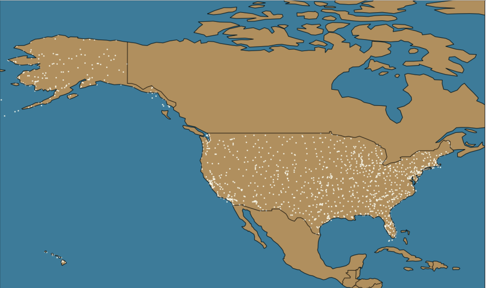
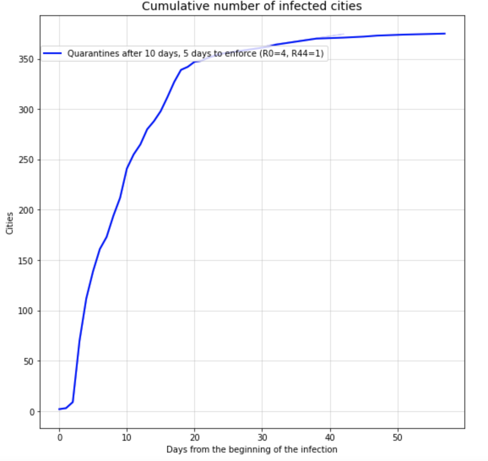
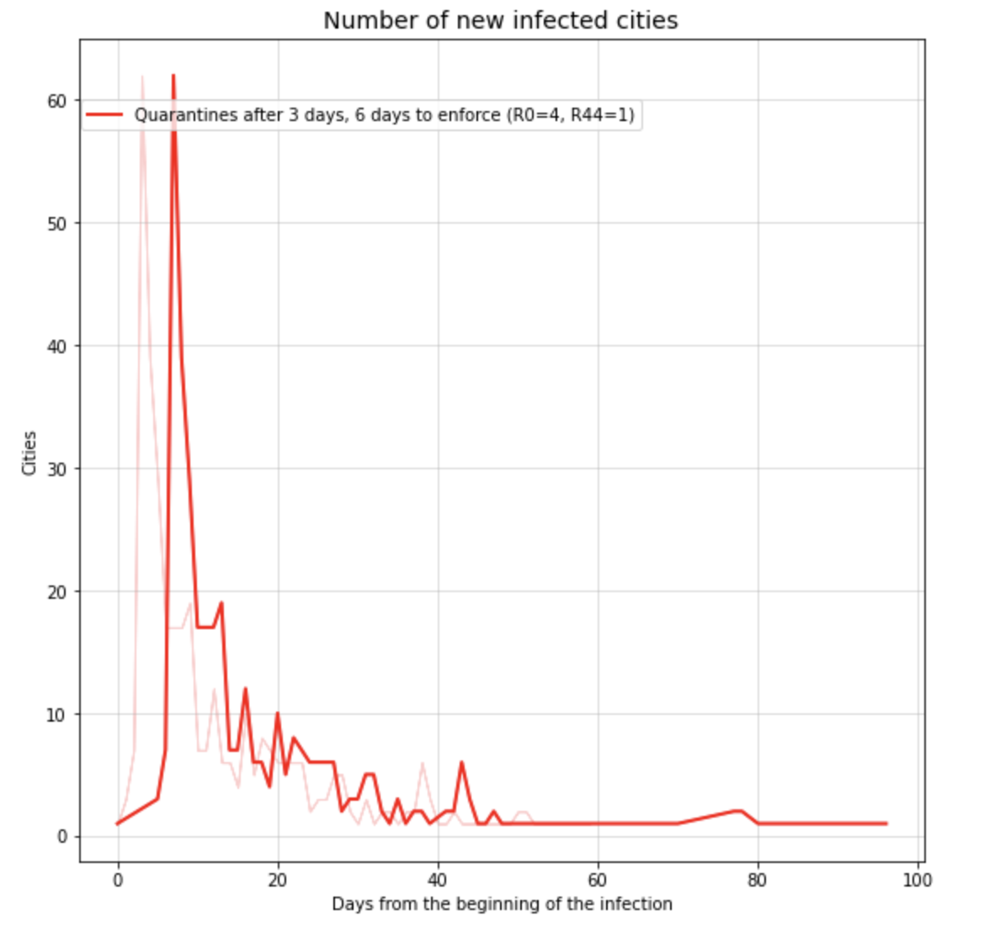
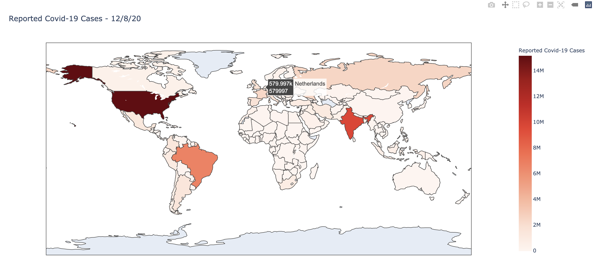
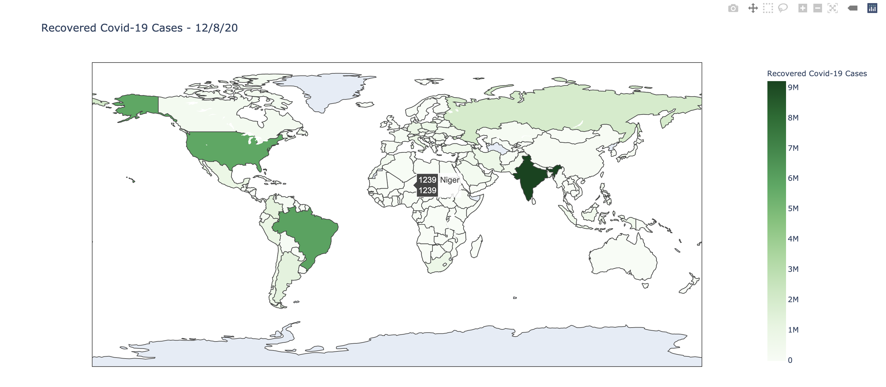

# Info6205 - FinalProject - Virus Transfer Simulation

#### Akash Sinha NU ID - 001344425 - <sinha.aka@northeastern.edu>
#### Ripan Halder NU ID - 001442993 - <halder.r@northeastern.edu>

#### Section - 2
#### Final Project Team No - 15

## Introduction
Since the onset of last year, the disease COVID-19 has spread all over the world and has infected millions of people and killed thousands of them. If not avoided, it could have been prevented from spreading all over the world. Airports and flights connections made it possible to spread very rapidly. 

Government intervention, quarantine measures and lockdown were undertaken in each country to mitigate the spread.  So, we planned to design our final project to understand these situations and analyze the spread of a similar virus if it arises in future. Also, we analyzed current COVID-19 data and displayed the results. 

Our project is built in Python and Jupyter Notebook. This project fetches data from public repositories and databases, processes the data, maps the data for an SIR Model (Susceptible, Infected & Recovered). 

The project collects airport and flight connections data of all the airports in USA and their flight connections between them. We projected a viral disease whose vaccination is not present similar to COVID 19. The infection starts in Boston on Day 0 and since the virus spreads by people coming in contact with each other, it spreads all across US through domestic flights connecting all the airports with each other. Considering that, the government intervenes after a particular day and takes few more days before a lockdown and quarantine start. In such a scenario since flights are connected, the virus spreads all across US. We have considered various other factors like city population, contact rate and recovery rate. We fix these values to simulate our results. So, the spread of the disease is in two modes in our assumptions, within the city using SIR model and air traffic spread to different cities. The airports are stored as a DiGraph.

## Running the project
1. Clone the project to your local repository
2. Installing pip:
    1. curl https://bootstrap.pypa.io/get-pip.py -o get-pip.py
    2. python get-pip.py
3. Install Jupyter
4. Install any packages not present using pip install
5. Fetc, parse the data and finally clean it before using it.
6. Run both files present in data_parsing folders first.
7. Results are stored in data fodler.
8. Then run, disease_spread jupyter file  and finally visualize  jupyter file.

## Observations

The results of the first 30 days of infection spread modelling (cities and directions of infection spread).

All the US Airports fetched from site https://www.flightconnections.com/ as shown below:

Cumulative number of cities affected with Quaranting intervention from 10 days and start after 5 days.

New cities infected daily because of flight connections

We are also analyzing the live data of current COVID-19 pandemic from John Hopkins datasets. Below are few current observations:

Total Cumulative COVID 19 Infected Cases

Total Cumulative COVID 19 Recovered Cases

New cases last 7 days

